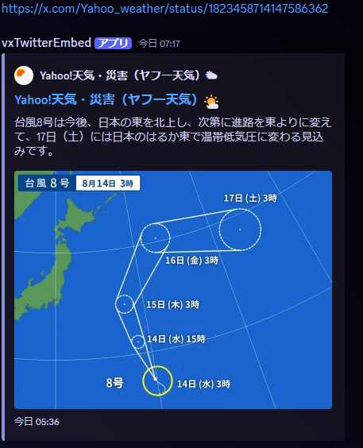

# replyvxtwitter

[](https://github.com/t1nyb0x/discord-twitter-embed-rx/actions/workflows/ci.yml)
[](https://codecov.io/gh/t1nyb0x/discord-twitter-embed-rx)

## これは何

Twitter（X）の投稿URLをDiscord上に発信すると、[vxTwitter](https://github.com/dylanpdx/BetterTwitFix)のAPIから内容を取得し、Discord上に展開します。



## 使い方

### 前提

Discord Developer Portalよりアプリケーションの作成を行ってください。
https://discord.com/developers/applications

作成の上、`.env.example` を `.env` へコピーしてトークンを設定してください。

productionとdevelopがありますが、どちらを設定しても動作に変わりはありません。本番と開発で2アカウント使用する場合にそれぞれセットする運用になります。

作成したアプリケーションは、使用したいサーバーに招待する必要があります。

パーミッションは
- bot scope
  - Send Messages
  - Embed Links
  - Read message History

の設定で問題ないかと思います。

### ローカルで動かす場合

`npm run compile && npm start`

### Dockerを利用する場合

1. `cp compose.yml.example compose.yml` を実行
2. `docker compose up -d` で立ち上がります

## テスト

このプロジェクトはVitestを使用してテストを実装しています。

### テストの実行

```bash
# すべてのテストを実行
npm test

# ユニットテストのみ実行
npm run test:unit

# 統合テストのみ実行（実際のAPI呼び出しを含む）
npm run test:integration

# UIモードで実行
npm run test:ui

# カバレッジレポート付きで実行
npm run test:coverage
```

### テスト構造

```
tests/
├── unit/                   # ユニットテスト
│   ├── core/              # ビジネスロジックのテスト
│   ├── adapters/          # アダプター層のテスト
│   └── infrastructure/    # インフラ層のテスト（未実装）
├── integration/           # 統合テスト
│   └── twitter-api.test.ts # 実際のTwitter API呼び出しテスト
└── fixtures/              # テストデータ
    ├── mock-tweets.ts
    └── test-urls.ts
```

詳細なテスト仕様については [testspec.md](./md/testspec.md) を参照してください。

## アーキテクチャ

このプロジェクトは軽量レイヤードアーキテクチャを採用しています。
詳細は [ARCHITECTURE.md](./ARCHITECTURE.md) を参照してください。

## トラブルシューティング

Dashboard 機能を使用している場合の障害対応クイックリファレンスです。

### 症状別 対応フロー

| 症状 | 原因の可能性 | 確認コマンド | 復旧手順 |
|------|-------------|-------------|---------|
| Bot が全く反応しない | Redis ダウン | `docker compose exec redis redis-cli ping` | `docker compose restart redis` |
| 設定変更が反映されない | pub/sub 切断 | ログで `Subscribe` を確認 | `docker compose restart twitter-rx` |
| Dashboard にログインできない | Redis ダウン or セッション期限切れ | Redis ping 確認 | Redis 再起動 or 再ログイン |
| 設定が「全許可」に戻った | Redis キー消失 | 設定キー確認 | `docker compose restart dashboard` |

### 確認コマンド集

```bash
# Redis 状態確認
docker compose exec redis redis-cli ping
# 期待値: PONG

# Bot のヘルスチェックログ確認
docker compose logs twitter-rx | grep -E "(Health|HEALTH|Subscribe|subscribe)"

# 設定キーの存在確認
docker compose exec redis redis-cli keys "app:guild:*:config" | head -10

# 特定ギルドの設定確認（YOUR_GUILD_ID を実際の ID に置き換え）
docker compose exec redis redis-cli get "app:guild:YOUR_GUILD_ID:config"

# Bot 参加状態確認
docker compose exec redis redis-cli keys "app:guild:*:joined"

# Dashboard 強制 reseed（Redis キー消失時）
docker compose restart dashboard
```

### 環境変数による挙動制御

| 変数 | 説明 | デフォルト |
|------|------|-----------|
| `REDIS_DOWN_FALLBACK` | Redis 障害時の挙動。`deny`: 全無視、`allow`: 全許可 | `deny` |
| `ENABLE_ORPHAN_CLEANUP` | 起動時の孤立キー掃除 | `true` |

詳細な仕様は [docs/DASHBOARD_SPEC.md](./docs/DASHBOARD_SPEC.md) を参照してください。
