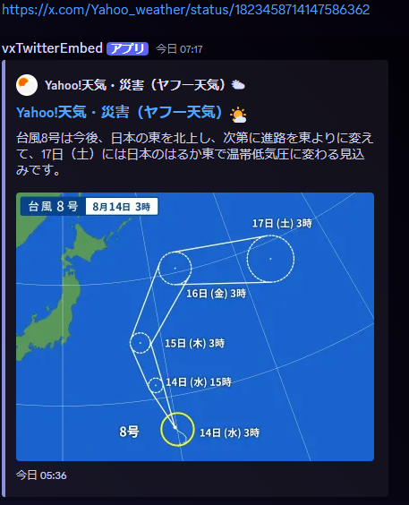

# TwitterRX

[](https://github.com/t1nyb0x/discord-twitter-embed-rx/actions/workflows/ci.yml)
[](https://codecov.io/gh/t1nyb0x/discord-twitter-embed-rx)

Twitter（X）の投稿 URL が Discord に送信されると、[vxTwitter](https://github.com/dylanpdx/BetterTwitFix) / [FxTwitter](https://github.com/FixTweet/FxTwitter) の API から内容を取得し、Embed として展開する Discord Bot です。



## 主な機能

- Twitter / X の URL を検出して自動で Embed 展開
- 画像・動画などのメディア添付に対応
- **Dashboard（Web UI）** からチャンネルごとの応答設定が可能
- Redis による設定キャッシュと pub/sub でリアルタイム反映

## 構成

```
TwitterRX/
├── src/                  # Bot 本体（TypeScript）
├── packages/shared/      # Bot・Dashboard 共通パッケージ
├── dashboard/            # Web Dashboard（Git サブモジュール・別リポジトリ）
├── compose.yml           # ローカル開発用 Docker Compose
├── compose.yml.example   # 本番デプロイ用（GHCR イメージ）
└── .config/              # アプリケーション設定（config.yml）
```

### 技術スタック

| コンポーネント      | 技術                                        |
| ------------------- | ------------------------------------------- |
| Bot                 | Node.js 24 / TypeScript / discord.js v14    |
| Dashboard           | Astro（SSR）/ Preact / Drizzle ORM / SQLite |
| キャッシュ・Pub/Sub | Redis 8                                     |
| テスト              | Vitest                                      |
| Lint / Format       | oxlint / oxfmt                              |

## セットアップ

### 前提条件

- Node.js 24+
- Docker & Docker Compose（Docker で動かす場合）
- [Discord Developer Portal](https://discord.com/developers/applications) でアプリケーションを作成済み

Bot の招待時に必要なパーミッション（bot scope）：

- チャンネルを表示
- メッセージを送る
- メッセージを管理
- リンクを埋め込み
- ファイルを添付
- メッセージ履歴を読む
- 低速モードを回避
-

### リポジトリのクローン

Dashboard を Git サブモジュールとして管理しています。

```bash
# サブモジュールを含めてクローン
git clone --recurse-submodules https://github.com/t1nyb0x/discord-twitter-embed-rx.git

# すでにクローン済みの場合
git submodule update --init --recursive
```

### 環境変数の設定

```bash
cp .env.example .env
```

`.env` に以下を設定してください：

| 変数                                 | 説明                                                              |
| ------------------------------------ | ----------------------------------------------------------------- |
| `PRODUCTION_TOKEN` / `DEVELOP_TOKEN` | Discord Bot トークン                                              |
| `NODE_ENV`                           | `production` または `develop`                                     |
| `REDIS_URL`                          | Redis 接続先（Docker 使用時は `compose.yml` で自動設定）          |
| `LOG_LEVEL`                          | `debug` / `info` / `warn` / `error`（省略時は `config.yml` の値） |

フォールバック設定（Dashboard 使用時）：

| 変数                        | 説明                                                 | デフォルト |
| --------------------------- | ---------------------------------------------------- | ---------- |
| `REDIS_DOWN_FALLBACK`       | Redis 障害時の挙動。`deny`: 全無視 / `allow`: 全許可 | `deny`     |
| `CONFIG_NOT_FOUND_FALLBACK` | 設定未作成時の挙動                                   | `deny`     |
| `ENABLE_ORPHAN_CLEANUP`     | 起動時に孤立した設定キーを掃除                       | `false`    |

## 起動方法

### Docker Compose（推奨）

Bot + Dashboard + Redis の 3 コンテナ構成で起動します。

```bash
# Dashboard の環境変数も設定
cp dashboard/.env.example dashboard/.env
# dashboard/.env を編集（OAuth2 設定・SESSION_SECRET 等）

# 起動
docker compose up -d

# ログ確認
docker compose logs -f
```

> **⚠️** `dashboard/.env` の `SESSION_SECRET` と `ENCRYPTION_SALT` は必ず生成してください。
>
> ```bash
> openssl rand -base64 32
> ```

### Bot のみ（Dashboard なし）

```bash
npm install
npm run build
npm start
```

Redis だけ必要な場合は `compose.yml.db-only` を使用してください。

### 本番デプロイ（GHCR イメージ）

`compose.yml.example` を参考に、VPS 上に配置してください。

```bash
# VPS 上で
mkdir -p ~/TwitterRX/dashboard
# .env, dashboard/.env を配置
cp compose.yml.example ~/TwitterRX/compose.yml

docker compose up -d
```

詳細は `compose.yml.example` 内のコメントを参照してください。

## 設定ファイル

`.config/config.yml` でアプリケーションの動作をカスタマイズできます。

| 設定                       | 説明                                             | デフォルト       |
| -------------------------- | ------------------------------------------------ | ---------------- |
| `media_max_file_size`      | Discord に添付するメディアの上限サイズ（バイト） | `5242800`（5MB） |
| `logging.logLevel`         | ログレベル（環境変数 `LOG_LEVEL` が優先）        | `info`           |
| `logging.maxFiles`         | ログファイル保持期間                             | `14d`            |
| `logging.maxSize`          | ログファイル最大サイズ                           | `20m`            |
| `logging.separateErrorLog` | エラーログを別ファイルに分離                     | `true`           |

## テスト

```bash
# すべてのテスト
npm test

# ユニットテストのみ
npm run test:unit

# 統合テスト（実際の API 呼び出しを含む）
npm run test:integration

# E2E テスト
npm run test:e2e

# カバレッジレポート
npm run test:coverage
```

## アーキテクチャ

軽量レイヤードアーキテクチャを採用しています。
詳細は [docs/ARCHITECTURE.md](./docs/ARCHITECTURE.md) を参照してください。

```
src/
├── index.ts              # エントリーポイント
├── config/               # アプリケーション設定
├── core/                 # ビジネスロジック（TweetProcessor, MediaHandler）
├── adapters/             # 外部接続（Discord, Twitter API）
├── infrastructure/       # HTTP クライアント・DB
├── fxtwitter/            # FxTwitter API
├── vxtwitter/            # vxTwitter API
├── db/                   # Redis 接続・リプライログ
└── utils/                # ロガー等
```

## トラブルシューティング

### 症状別 対応フロー

| 症状                         | 原因の可能性               | 確認コマンド                               | 復旧手順                                          |
| ---------------------------- | -------------------------- | ------------------------------------------ | ------------------------------------------------- |
| Bot が全く反応しない         | Redis ダウン               | `docker compose exec redis redis-cli ping` | `docker compose restart redis`                    |
| 設定変更が反映されない       | Pub/Sub 切断               | ログで `Subscribe` を確認                  | `docker compose restart twitter-rx`               |
| Dashboard にログインできない | Redis / セッション期限切れ | Redis ping 確認                            | Redis 再起動 or 再ログイン                        |
| 設定が初期化された           | Redis キー消失             | `redis-cli keys "app:guild:*:config"`      | `docker compose restart dashboard`（reseed 発動） |

### バックアップと復旧

Dashboard は named volume でデータを永続化しています。

```bash
# SQLite バックアップ
docker run --rm \
  -v twitterrx_dashboard_data:/source:ro \
  -v $(pwd)/backup:/backup \
  alpine tar cvf /backup/dashboard-$(date +%Y%m%d).tar -C /source .

# Redis バックアップ
docker run --rm \
  -v twitterrx_redis_data:/source:ro \
  -v $(pwd)/backup:/backup \
  alpine tar cvf /backup/redis-$(date +%Y%m%d).tar -C /source .
```

Redis が消えた場合は Dashboard を再起動すれば SQLite → Redis への reseed が自動実行されます。

## 関連リポジトリ

- [Dashboard](https://github.com/t1nyb0x/discord-twitter-embed-rx-dashboard) — Web UI（`dashboard/` サブモジュール）

## ライセンス

[MIT](./LICENSE)
